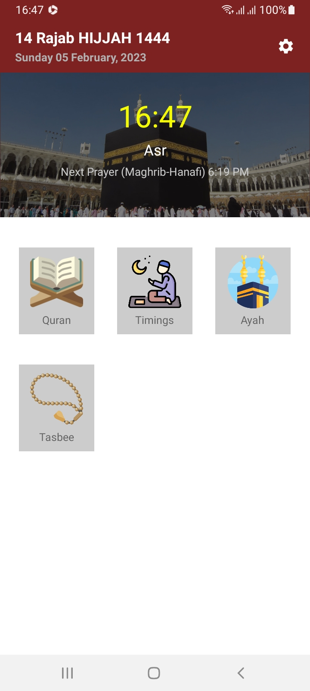
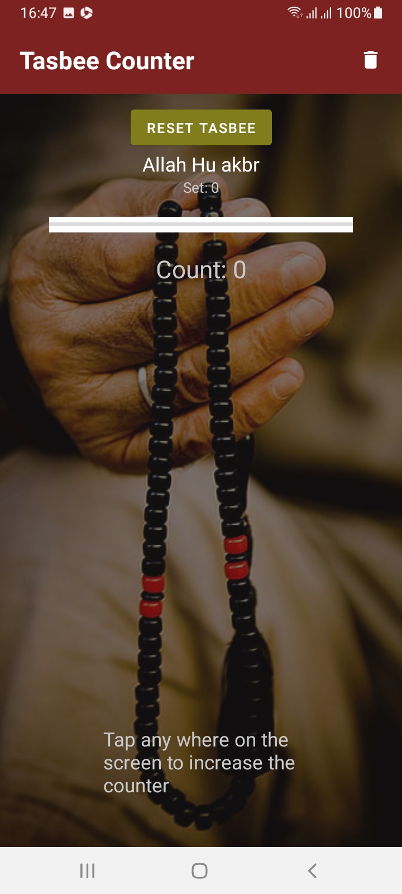

## Islamic Prayer Companion

### Introduction:
Islamic Prayer Companion is a comprehensive mobile application designed to assist Muslims with their daily
prayers and other religious obligations. The app provides accurate prayer timings, Qibla direction, Tasbeeh
(prayer counting) functionality and Quran recitation with translation all in one convenient location.

### Features:
• Accurate prayer timings based on the user's current location
• Qibla direction indicator using the device's built-in compass
• Tasbeeh (prayer counting) feature with customizable settings
• Azan (call to prayer) alarm for each prayer
• Daily Hadith (sayings of Prophet Muhammad) and Duas (supplications)
• Quran recitation with multiple translations in different languages
• Option to set reminders for prayer timings and other religious obligations
• Easy-to-use interface with minimalistic design

### Target Audience:
The target audience for this app is primarily Muslims of all ages who are looking for an easy and convenient way
to keep track of their daily prayers and other religious obligations and improve their Quranic understanding.

### Benefits:
The app will help Muslims stay on top of their religious obligations and practice their faith more consistently.
The accurate prayer timings and Qibla direction feature will ensure that they are able to perform their prayers on
time and in the correct direction. The Tasbeeh feature will aid in their spiritual practice, while the daily Hadith
and Duas will deepen their understanding of the religion. The Quran recitation feature with translation will help
users to understand and contemplate the Quran easily. The reminders feature will help users stay organized and
on schedule.

### Screen Shots

  
  

  
  

### Platform:
The app will be developed for the Android platform and will be available for download on the Google Play Store.

### Conclusion:
Islamic Prayer Companion is an all-in-one mobile application that will assist Muslims with their daily prayers
and other religious obligations. The app will provide accurate prayer timings, Qibla direction, Tasbeeh
functionality, Quran recitation with translation, all in a convenient and easy-to-use interface. With this app,
Muslims will be able to stay on top of their religious obligations and deepen their understanding of their faith,
and Quranic knowledge
